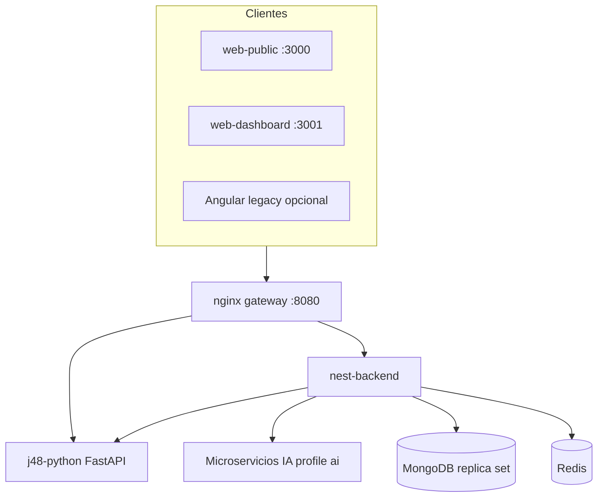

# Arquitectura enterprise — Centro COP

## Visión general

Plataforma médica modular para centro odontológico y psicológico con dos frentes Next.js y API NestJS central.



## Módulo 1 — Web pública (`web-public`)

| Capacidad | Implementación |
|-----------|----------------|
| Landing SEO | Next.js App Router, metadata OpenGraph |
| Auth paciente | JWT via `/api/auth/*`, Zustand persist |
| Reservas | `/public/bookings`, disponibilidad, cotización |
| Pagos | Wompi (Colombia) + Stripe/PayPal (`/public/payments/intl/*`) |
| Perfil | `/account` + `/api/users/me` |

## Módulo 2 — Dashboard clínico (`web-dashboard`)

| Rol | Rutas |
|-----|-------|
| ADMIN / ORG_ADMIN | Dashboard, admin, analytics |
| ODONTOLOGO | Pacientes, odontograma (Angular legacy o futuro puerto) |
| PSICOLOGO | Psicología, J48, escalas |
| RECEPCIONISTA | Agenda, pacientes |

Dark mode por defecto (`html.dark`), gráficas Recharts, React Query.

## Backend Nest (`nest-migration`)

- **IAM**: JWT + refresh + blacklist Redis + RBAC ampliado
- **PsychologyModule**: sesiones, escalas GAD-7/PHQ-9/PSS-10, DSM-like, evolución
- **J48ScoringModule**: scoring masivo, analytics
- **PaymentsIntlModule**: Stripe PaymentIntent, PayPal Orders v2
- **AiProxyModule**: proxy a diagnosis, emotion, relapse, árbol J48
- **PublicSiteModule**: booking + Wompi

## IA — J48 Python (`services/j48-python`)

- `DecisionTreeClassifier` (entropy) entrenado desde `datasets/relapse_risk_j48.arff`
- API compatible: `POST /predict`, `GET /model/tree`, `POST /train`
- Respuesta extendida: `riskScore`, `alertLevel`, `recommendations`

## Seguridad

- Helmet, throttling global, ValidationPipe
- JWT fail-closed con Redis en producción
- CORS configurable (`CORS_ORIGINS`)
- Sanitización vía class-validator en DTOs
- Datos clínicos segregados por `organizationId` (TenancyInterceptor)

## Base de datos MongoDB

Colecciones principales: `users`, `patients`, `appointments`, `psychology_sessions`, `psychological_evaluations`, `j48_predictions`, `psychological_snapshots`, `odontograms`, `treatment_plans`, `clinical_records`, `public_bookings`, `audit_logs`.

Índices definidos en schemas Mongoose (psychology, j48, etc.).

## DevOps

```bash
docker compose --profile core up -d --build
```

Servicios core: MongoDB, Redis, nest-backend, j48-python, gateway, ortho-ai.

Perfil `ai`: ai-diagnosis, emotion-analysis, recommendation-engine.

Perfil `j48-java`: servicio Weka legacy (opcional).

### Variables clave

| Variable | Uso |
|----------|-----|
| `J48_URL` | Base URL microservicio J48 (sin `/predict`) |
| `STRIPE_SECRET_KEY` | Pagos internacionales |
| `PAYPAL_CLIENT_ID/SECRET` | PayPal checkout |
| `NEXT_PUBLIC_API_URL` | Frontends Next → gateway |

## CI/CD

GitHub Actions: build Nest, Angular legacy, **web-public**, **web-dashboard**, smoke env producción.

## Puertos locales

| Servicio | Puerto |
|----------|--------|
| web-public | 3000 |
| web-dashboard | 3001 |
| gateway API | 8080 |
| Angular panel (legacy) | 5173 |

## Migración Angular → Next

Los proyectos `Frontend/` y `PublicWeb/` permanecen operativos. Los nuevos `web-*` consumen la misma API Nest sin cambios de contrato en rutas públicas y `/api/*`.
